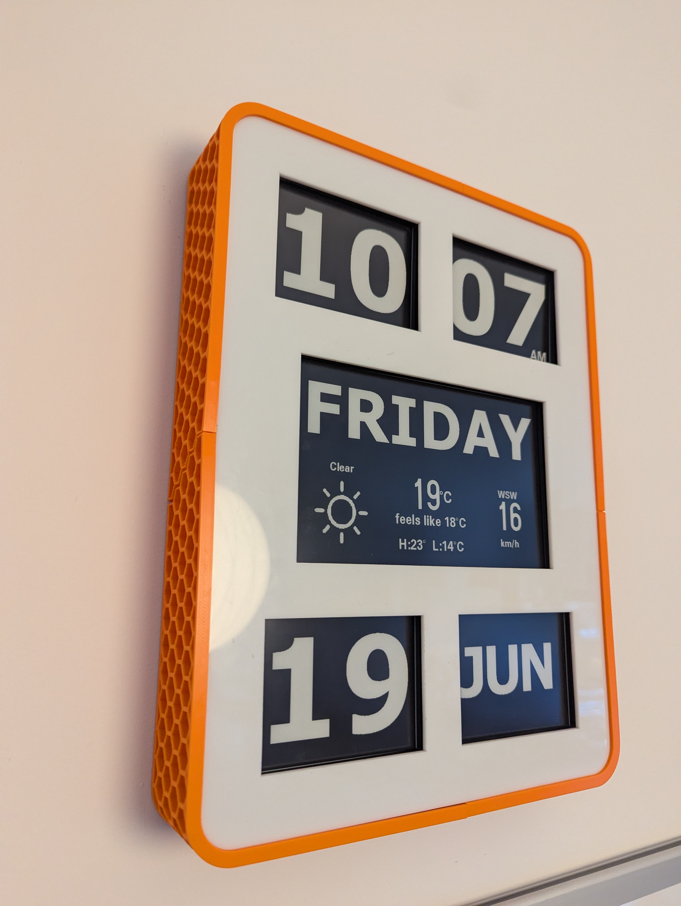

# ESP32 E-Ink Clock

A wall clock built on an ESP32 driving five e-paper displays. Shows time, date,
day of week, and live weather data fetched from Open-Meteo.

3D printed case available on Printables: [E-Paper Clock](https://www.printables.com/model/1758792-e-paper-clock)

## Displays

| Panel | Model | Content | CS | BUSY |
|---|---|---|---|---|
| display1 | GxEPD2_420_GDEY042T81 (4.2") | MM — minutes | 5 | 4 |
| display2 | GxEPD2_420_GDEY042T81 (4.2") | HH — hours (12hr) | 19 | 26 |
| display3 | GxEPD2_420_GDEY042T81 (4.2") | DD — day of month | 14 | 12 |
| display4 | GxEPD2_420_GDEY042T81 (4.2") | MMM — month | 32 | 33 |
| display5 | GxEPD2_750_GDEY075T7 (7.5") | Day of week + weather | 25 | 27 |

All displays share SPI: **MOSI=23, SCK=18, DC=22, RST=21**

## Features

- Time synced via NTP on startup and every 30 minutes
- Weather from [Open-Meteo](https://open-meteo.com/) (no API key required) — temperature, feels like, high/low, wind direction and speed, condition icon
- Partial refresh every minute, full refresh hourly
- Day/month displays only refresh when the value actually changes
- Light sleep between updates for low power draw
- Toronto coordinates by default — change `LAT`/`LON` in the sketch

## Dependencies

Install via Arduino Library Manager:

- [GxEPD2](https://github.com/ZinggJM/GxEPD2)
- [U8g2_for_Adafruit_GFX](https://github.com/olikraus/U8g2_for_Adafruit_GFX)
- [ArduinoJson](https://arduinojson.org/)

Board: **ESP32 Dev Module** (Arduino IDE → Board Manager → esp32 by Espressif)

## Setup

1. Copy `secrets.h.example` to `secrets.h` and fill in your WiFi credentials
2. Adjust `LAT` / `LON` in `Counting_Seconds.ino` for your location
3. Set timezone string in `connectSyncAndFetch()` (currently `EST5EDT,M3.2.0,M11.1.0`)
4. Compile and upload

## Bitmaps

`bitmaps.h` contains PROGMEM bitmap arrays for digits (0–9), days of week, and
months, generated with [image2cpp](https://javl.github.io/image2cpp/).
`weather_icons.h` contains seven 128×128 weather condition icons.

## Status

Work in progress — layout and typography still being refined.
