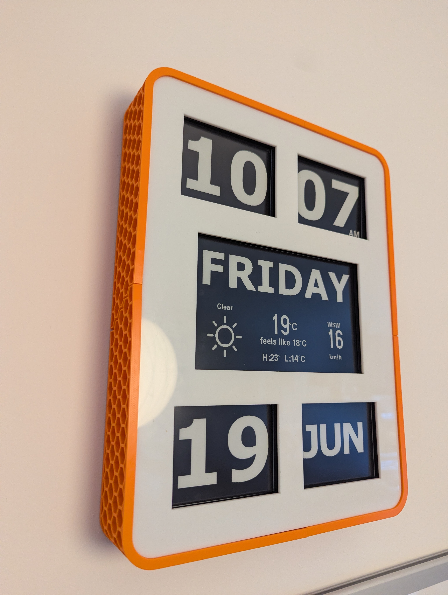

# ESP32 E-Ink Clock

A battery-powered wall clock built on a FireBeetle 2 ESP32-C5 driving five
e-paper displays. Shows time, date, day of week, and live weather data fetched
from Open-Meteo.

3D printed case available on Printables: [E-Paper Clock](https://www.printables.com/model/1758792-e-paper-clock)

## Displays

GPIO numbers with the board's silkscreen label in brackets — the FireBeetle
labels every pin as `GPIO/alias`, so `8/D2` is GPIO8.

| Panel | Model | Content | CS | BUSY |
|---|---|---|---|---|
| display1 | GxEPD2_420_GDEY042T81 (4.2") | MM — minutes | 8 (`8/D2`) | 6 (`6/D12/LP_SDA`) |
| display2 | GxEPD2_420_GDEY042T81 (4.2") | HH — hours (12hr) | 5 (`5/A4/LP_TX`) | 11 (`11/TX`) |
| display3 | GxEPD2_420_GDEY042T81 (4.2") | DD — day of month | 4 (`4/A3/LP_RX`) | 25 (`25/MI`) |
| display4 | GxEPD2_420_GDEY042T81 (4.2") | MMM — month | 3 (`3/A2`) | 7 (`7/D11/LP_SCL`) |
| display5 | GxEPD2_750_GDEY075T7 (7.5") | Day of week + weather | 2 (`2/A1`) | 12 (`12/RX`) |

Shared by all five panels:

| Display pin | GPIO | Silkscreen |
|---|---|---|
| DIN (MOSI) | 24 | `24/MO` |
| CLK (SCK) | 23 | `23/SCK` |
| DC | 10 | `10/SCL` |
| RST | 9 | `9/SDA` |
| VCC | — | `3V3` (always-on rail) |
| GND | — | any `GND` |

The 7.5" panel also has a **PWR** pin — a power-enable input, not a supply. Tie
it to `3V3` as well; left floating, the module never powers up.

> Do not use the `3V3_C` pin for display power. It's a switched rail controlled
> by GPIO0 and **defaults to off**, so a panel wired to it stays completely dead
> with no error.

See [MIGRATION.md](MIGRATION.md) for full wiring, required Arduino IDE settings,
and board-specific gotchas.

## Features

- Time synced via NTP on startup and every 30 minutes
- Weather from [Open-Meteo](https://open-meteo.com/) (no API key required) — temperature, feels like, high/low, wind direction and speed, condition icon
- Partial refresh every minute, full refresh hourly
- Day/month displays only refresh when the value actually changes
- Deep sleep between updates, with all display controllers hibernated
- Weather failures keep the last good reading on screen rather than blanking
- Battery voltage read on GPIO1 and shown on the weather panel
- Location and timezone configured in `secrets.h`

## Dependencies

Install via Arduino Library Manager:

- [GxEPD2](https://github.com/ZinggJM/GxEPD2)
- [U8g2_for_Adafruit_GFX](https://github.com/olikraus/U8g2_for_Adafruit_GFX)
- [ArduinoJson](https://arduinojson.org/)

Board: **FireBeetle 2 ESP32-C5** (DFR1222), using esp32 core 3.x by Espressif.
Requires a partition scheme with ≥2MB app space, PSRAM disabled, and USB CDC on
boot enabled — see [MIGRATION.md](MIGRATION.md).

## Setup

1. Copy `secrets.h.example` to `secrets.h` and fill in your WiFi credentials,
   location coordinates, and [POSIX timezone string](https://github.com/nayarsystems/posix_tz_db/blob/master/zones.csv)
2. Compile and upload

## Bitmaps

`bitmaps.h` contains PROGMEM bitmap arrays for digits (0–9), days of week, and
months, generated with [image2cpp](https://javl.github.io/image2cpp/).
`weather_icons.h` contains seven 128×128 weather condition icons.

## Status

Work in progress — layout and typography still being refined.
